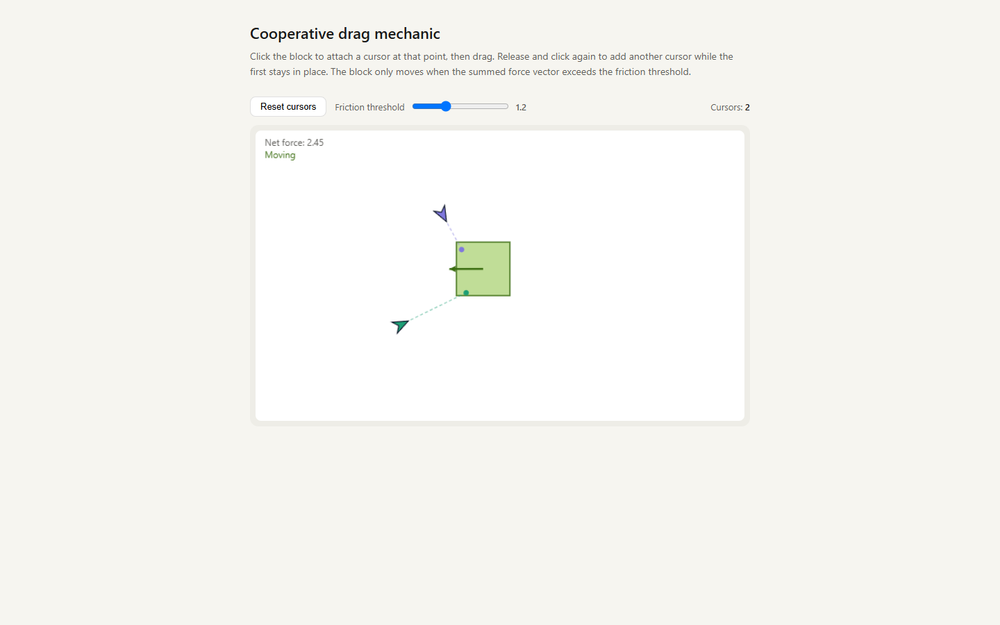

# Cursory

A cooperative multiplayer puzzle game in the browser: every player's cursor shares one 10,000 x 10,000 world, and heavy blocks, shapes and circuits only move when you pull together.

     



The capture above is the standalone [cooperative-drag.html](cooperative-drag.html) prototype of the core mechanic: open it in any browser, no build needed. The full game is a Blazor Server app. Its Azure App Service deploy target (`cursory`) is stopped, so there is no public demo: run it locally (see Quick start).

## Why

- Play together without typing: there is no chat, only a whistle. Cooperation happens through the physics.
- Feel every other player in real time: all cursors render for everyone on one shared, pannable world with a minimap.
- Read the puzzle at a glance: each body prints its Mass, and it moves exactly when the pulls on it add up past that number.
- Learn by playing: 14 levels walk from "drag one light block" to cooperative heaves, couch-pivoting shapes and a series circuit.
- Trust what you see: the server owns the whole simulation, so every client sees the same world and nobody can cheat a block into place.

## Features

### Cooperative physics

- Real rigid bodies from [Aether.Physics2D](https://github.com/nkast/Aether.Physics2D) (Box2D port), gravity-free and top-down.
- Each grab is a force-capped `FixedMouseJoint`; each block has a `FrictionJoint` to static ground. One cursor tops out at 1.5 mass-units of pull (`SingleGrabMaxMass`), so heavier bodies need two players.
- Grabs snap to the nearest edge of the body, and where you grab decides the torque: offset pulls rotate a body so you can thread it through a gap.
- Compound shapes (`ShapeActor` built from `ShapePiece` boxes, such as an L) rotate under full rigid-body torque.
- Optional segmented tether: the rope catches a body's corners so you can spin it by swinging behind it.
- Optional cursor-vs-wall collision, toggled per player.

### The room

- One shared 10,000 x 10,000 px world. Drag empty space to pan; a minimap shows every cursor and your viewport.
- Whistle: click empty space and everyone sees a coloured ripple and hears a Web Audio tone keyed to your colour.
- Voting: any player can propose a level reset or a level switch. It passes at a 2/3 quorum of the roster and times out after 15 s (450 ticks at 30 Hz).
- Connection-status pill with SignalR auto-reconnect; silent cursors are evicted.

### Levels

14 engine-backed levels, tuned for two players, seeded in `RoomState` (`SeedLevel1` to `SeedLevel14`):

| Level | Title |
| --- | --- |
| 1 | Drop it on the pad |
| 2 | Too heavy for one |
| 3 | Pivot the couch |
| 4 | Stand together, then heave |
| 5 | Heavy heave |
| 6 | Mirror match |
| 7 | Stand and slide |
| 8 | Block taxi |
| 9 | Couch corner |
| 10 | Tug steady |
| 11 | Two-key lock |
| 12 | Spinner |
| 13 | Door hold |
| 14 | Light the bulb |

Level 14 is an electronics puzzle: drag wire ends onto terminals to close a series loop through a battery, resistor and bulb, and the bulb lights.

### Three renderers, one backend

After sign-in, the landing page offers the same game drawn three ways: Canvas2D (`/room/canvas2d`), Three.js (`/room/three`) and Babylon.js (`/room/babylon`). All three share one client core for networking, input, camera, picking, HUD, audio and the overlay; only the world drawing differs.

## Quick start

Prerequisites: the .NET 10 SDK.

```powershell
git clone https://github.com/mindattic/Cursory.git
cd Cursory
dotnet build Cursory.slnx
dotnet test  Cursory.slnx
dotnet run --project Cursory.Blazor
```

Open `https://localhost:7238` (or `http://localhost:5238`) and sign in with one of the seeded accounts below. Pick a renderer. To see cooperative play locally, open a second browser window (or an incognito window) and sign in as the other seeded user: both cursors appear in the same room.

To feel the core mechanic without the app, open [cooperative-drag.html](cooperative-drag.html) directly in a browser.

## How it works

```text
        browser: three parallel renderers, one shared backend
        wwwroot/shared/room-core.js  networking, input, camera, picking, HUD, audio,
                                     + the overlay (cursors/tethers/whistles/labels/minimap)
        wwwroot/{canvas2d,three,babylon}/room.js + renderer.js  world adapter only
        (canvas2d: 2D calls on #room-canvas; three/babylon: WebGL meshes on #room-canvas,
         orthographic top-down camera, overlay drawn on a transparent #room-overlay on top)
                        |   ^
            Move/Grab/  |   |  Geometry (once) + Snapshot (30 Hz) + LevelLoaded
            Release/    |   |
            Whistle/    v   |
            Vote   +----------------------------------------------+
                   | Cursory.Blazor (ASP.NET Core Blazor Server)  |
                   |  Program.cs  cookie auth, antiforgery,       |
                   |              rate-limited /api/auth/login,   |
                   |              forwarded headers, seed users   |
                   |  Hubs/RoomHub.cs        write-only SignalR   |
                   |  Services/GameLoopService.cs  30 Hz tick     |
                   |  Cursory.Shared/.../EnginePicker.razor  "/"  |
                   |  Cursory.Shared/.../Home.razor               |
                   |                 "/room/{Engine}"             |
                   +-----------------------+----------------------+
                                           | owns
                   +-----------------------v----------------------+
                   | Cursory.Core                                 |
                   |  RoomState  -- Aether.Physics2D World        |
                   |     (gravity-free, top-down, worldLock)      |
                   |  AuthService, UserRepository (JSON file)     |
                   +----------------------------------------------+
```

The canonical copy of this diagram is in [docs/BIBLE.md](docs/BIBLE.md) (section 4); if this one drifts, the bible wins.

### Multiplayer

The server owns the simulation. Clients send only their cursor position (and grab, release, whistle and vote events) at 30 Hz over SignalR. `GameLoopService` runs a fixed-rate physics tick on `RoomState` and broadcasts an authoritative `WorldSnapshot` to every connected client. Clients render and interpolate; they never tell the server where a body is.

Static world geometry (walls, labels) is delivered once on connect, and again on a level change, via `WorldGeometryMessage`, never on the 30 Hz snapshot (`CUR-LAW-6` in the bible). Wire payloads are in world pixels and camelCase; the engine runs in metres at 100 px per metre, converted only at the engine boundary.

### Cooperative drag

Each grab is a `FixedMouseJoint` force-capped at a single-cursor ceiling; each block's `FrictionJoint` to a static ground gives it dry friction. A body's move threshold is `Mass x ForcePerMass` and a cursor's reported pull is `force / ForcePerMass`, so a body moves exactly when the pulls on it sum past its printed Mass. A single cursor cannot break a heavy block free; two cursors stack their pull past the threshold. Offset grabs produce real torque, so cooperating cursors can rotate a body through a gap.

### Compound shapes

`ShapeActor` bodies are built from several `ShapePiece` rectangles in body-local space (for example an L-shape). Grabs on shapes drive full rigid-body torque via the Aether solver.

### Circuit levels

`CircuitComponent` (battery, resistor, bulb), `Terminal` and `Wire` records model breadboard-style wiring. A cursor grabs a wire end and drags it onto a terminal; the evaluator lights the bulb when a closed series loop is formed, and keeps it dark on a gap or when the resistor is bypassed.

### Whistle, pan and minimap

Click empty space and the server records a `Whistle` and ships it on the next snapshot. Clients render a coloured ripple and play a Web Audio tone keyed by each player's colour. Drag empty space to pan the 10,000 x 10,000 world; the minimap in the corner shows all cursors and the viewport rectangle.

## Projects

`Cursory.slnx` (the slnx solution format) wires up four projects, all targeting `net10.0`:

| Project | Kind | Role |
| --- | --- | --- |
| [Cursory.Core](Cursory.Core) | class library | Domain models and services, no ASP.NET dependency. `UserAccount` and `UserRepository` (JSON file store at `%APPDATA%\MindAttic\Cursory\users.json`), `AuthService` (BCrypt, lockout, security stamp), `RoomState`: the authoritative simulation on Aether.Physics2D. |
| [Cursory.Shared](Cursory.Shared) | Razor class library | `EnginePicker.razor` (`/`, links to the three renderer routes) and `Home.razor` (`/room/{Engine}`, the gated room page). References `Cursory.Core`. |
| [Cursory.Blazor](Cursory.Blazor) | ASP.NET Core Web SDK, entry point | Blazor Server host: cookie auth, antiforgery, rate-limited `/api/auth/login`, `RoomHub` (SignalR), `GameLoopService` (30 Hz physics tick and snapshot broadcast). |
| [Cursory.Tests](Cursory.Tests) | NUnit 4 | `AuthService`, `RoomState` physics, grabs and eviction, votes and levels, circuit evaluation, level solvability. References `Cursory.Core` only. |

### Cursory.Core

- `Models/GameState.cs`: the domain nouns. `CursorState`, `BlockState`, `ShapeActor` and `ShapePiece` (compound rigid bodies), `Wall`, `GoalZone` and `ShapeGoal`, `CircuitComponent`, `Terminal` and `Wire` (the electronics level), `Whistle`, `RoomVote` and `VoteKind`, `WorldLabel`, `WorldSnapshot` and `WorldGeometryMessage`, plus legacy unwired types (`SwitchTile`, `Door`, `ShapeAttachment`) kept only so old level data still deserializes.
- `Models/UserAccount.cs`: username-based account with BCrypt `PasswordHash`, `SecurityStamp`, `Color` and `Role`.
- `Services/RoomState.cs`: one Aether.Physics2D `World` (gravity-free, top-down). `Step()` drives each grab joint, steps the engine, syncs poses back, updates tethers and leashes, evaluates goals and the circuit, and ages out whistles and votes. `Snapshot()` and `GeometryMessage()` build defensive copies for broadcast. All engine access is serialized under a `worldLock`.
- `Services/AuthService.cs`: BCrypt hashing (work factor 12), per-account lockout (10 failures, 5 minutes), constant-time verify on missing users, security-stamp invalidation on password or role change, idempotent policy-bypassing `SeedUser`, `SetAllPasswords`, a strict `CreateUser` policy, and the `IsLocalUrl` open-redirect filter.
- `Services/UserRepository.cs`: thread-safe JSON-file store with atomic temp-file-then-`File.Move` writes and defensive copies on read.
- `Services/CursoryServices.cs`: `AddCursoryCore` DI registration; resolves `Cursory:UsersPath` from config or defaults to `%APPDATA%\MindAttic\Cursory\users.json`.
- Packages: `Aether.Physics2D`, `BCrypt.Net-Next`, and the `Microsoft.Extensions` DI, Configuration and Hosting abstractions. No ASP.NET Core dependency, so it can be tested and reused headlessly.

### Cursory.Shared

- `Components/Pages/EnginePicker.razor`: `/`, the post-login landing page linking to `/room/canvas2d`, `/room/three` and `/room/babylon`.
- `Components/Pages/Home.razor`: `/room/{Engine}`, the gated room page. Opens the SignalR connection to `/hubs/room` and imports `wwwroot/{Engine}/room.js` (which lives in `Cursory.Blazor`, the hosting project).

### Cursory.Blazor

- `Program.cs`: composition root. `AddCursoryCore`, `GameLoopService` as a hosted `BackgroundService`, Razor Components with interactive server render mode, SignalR (8 KB receive cap), cookie authentication (`Cursory.Auth` cookie, 30-day sliding expiration, `SecurityStamp` re-validated on every request), per-IP fixed-window rate limiting on login (10 per minute), forwarded-headers handling for Azure's proxy, and the one-shot seed of the demo accounts.
- `Hubs/RoomHub.cs`: write-only SignalR hub at `/hubs/room` with `Move`, `Grab`, `GrabShape`, `GrabWall`, `GrabWireEnd`, `Release`, `Whistle`, `StartResetVote`, `StartLevelVote`, `CastVote`, `SetCursorCollision` and `SetSegmentedTether`. Methods never return state; everything rides the broadcast snapshot.
- `Services/GameLoopService.cs`: the 30 Hz `BackgroundService`. Steps `RoomState`, evicts stale cursors every 30 ticks, rebroadcasts geometry and announces a level on change, broadcasts the snapshot, idles when nobody is connected, and logs slow ticks.
- `Components/`: `App.razor`, `Layout/MainLayout.razor`, `Pages/Login.razor`, `Pages/Error.razor`, `RedirectToLogin.razor`, `Routes.razor`.
- `wwwroot/shared/room-core.js`: the renderer-agnostic client core. SignalR connection, `clientToWorld` transform, pan and zoom, grab picking, whistle audio, HUD (level select, reset vote, connection-status pill) and the vector and text overlay (cursors, tethers, whistle ripples, labels, mass numbers, minimap).
- `wwwroot/canvas2d/`, `wwwroot/three/`, `wwwroot/babylon/`: one `room.js` entry point and one `renderer.js` world adapter per engine, drawing only the solid game world (grid, walls, blocks, shapes, goals, switches, doors, circuit). See [docs/BIBLE.md](docs/BIBLE.md), section 4.4.
- Two auth endpoints: `POST /api/auth/login` (antiforgery, rate limit, open-redirect guard; issues the cookie) and `POST /api/auth/logout`.

## Accounts

There is no self-service signup; accounts are operator-seeded. Two demo accounts are seeded idempotently on first run, bypassing the strict password policy:

| Username | Colour |
| --- | --- |
| gungreeneyes | #D85A30 |
| gideonkain | #378ADD |

The operator-chosen demo password is set in `Cursory.Blazor/Program.cs` (`SeedUser` and `SetAllPasswords`), which keeps every account on it. In Development, a gitignored `.env` at the repo root (see [.env.example](.env.example)) pre-fills the login form. Accounts created through `CreateUser` must meet the strict policy: at least 8 characters with upper case, lower case, a digit and a special character.

## Testing

```powershell
dotnet test Cursory.slnx
```

`Cursory.Tests` references `Cursory.Core` only (via `InternalsVisibleTo`), so it exercises the simulation and auth headlessly with no ASP.NET Core host:

| File | Covers |
| --- | --- |
| AuthServiceTests.cs | Seed idempotency, `SetAllPasswords`, lockout, weak-password rejection, `IsLocalUrl` open-redirect filter. |
| UserRepositoryTests.cs | Empty-path rejection at construction. |
| RoomStateTests.cs | Edge-snap grab, clamp-to-body, pull in mass units, one cursor moves a light block but not a heavy one, two cursors break friction, opposing pulls cancel, offset pulls rotate, detach removes force, shape edge-grab and drag, leash length, cursor-vs-wall nudge, segmented-tether wrap and corner catch, NaN drop, stale-cursor eviction, geometry on its own channel, `LevelCount == 14`, every level seeds and steps. |
| SolvabilityTests.cs | Every block level is auto-solvable by two virtual cursors; rotation and thread shape levels are provably movable. |
| VoteAndLevelTests.cs | Solo quorum resolves at once, two voters need both, early reject when quorum is unreachable, level switch moves state and queues a rebroadcast, no-op and out-of-range targets rejected. |
| CircuitTests.cs | Bulb lights on a complete series loop; dark on a gap; dark when the resistor is bypassed. |

The realtime UI and SignalR path are exercised by hand only; there is no automated browser gate (see [docs/BIBLE.md](docs/BIBLE.md), section 6).

## Building

`TreatWarningsAsErrors=true` is set in [Directory.Build.props](Directory.Build.props); missing XML doc comments (`CS1591`) are the only warning class allowed to survive a build. `Nullable` and `ImplicitUsings` are enabled solution-wide, and [global.json](global.json) sets the SDK to `rollForward: latestMajor`.

## The cooperative-drag prototype

[cooperative-drag.html](cooperative-drag.html) is a standalone, dependency-free HTML page (inline CSS and vanilla JS, one canvas, no build step) that demonstrates the original cooperative-drag mechanic Cursory was built around, before the engine port:

- One draggable block with a hand-rolled sum-of-springs model: each attached cursor pulls toward its anchor point (`SPRING_K`), the forces sum, and the block moves only once the summed force exceeds a friction threshold you set with a slider.
- Click the block to attach a cursor at that point; release and click again to attach another while the first stays put. Re-grab a cursor by clicking near its head.
- A live HUD prints the net force and whether the block is "Moving" or "Below threshold" (green or grey block).

It is a quick way to feel why two cursors are needed to move a heavy block. It is not wired to the current game: the game uses Aether.Physics2D rigid bodies, `FrictionJoint`s and `FixedMouseJoint` grabs instead of springs (see [docs/BIBLE.md](docs/BIBLE.md), section 3). The file is not part of the solution and is not built, tested or served by `Cursory.Blazor`.

## Project layout

```text
Cursory/
├─ Cursory.slnx                  solution file (Core, Shared, Blazor, Tests)
├─ Directory.Build.props         shared MSBuild settings (nullable, warnings-as-errors, ...)
├─ global.json                   .NET SDK roll-forward policy
├─ NuGet.config
├─ cooperative-drag.html         standalone sum-of-springs prototype
├─ Cursory.Core/                 domain models + services (no ASP.NET dependency)
│  ├─ Models/                    GameState.cs, UserAccount.cs
│  └─ Services/                  RoomState.cs, AuthService.cs, UserRepository.cs, CursoryServices.cs
├─ Cursory.Shared/               Razor component library
│  └─ Components/Pages/          EnginePicker.razor ("/"), Home.razor ("/room/{Engine}")
├─ Cursory.Blazor/               ASP.NET Core Blazor Server host (entry point)
│  ├─ Program.cs
│  ├─ Hubs/RoomHub.cs
│  ├─ Services/GameLoopService.cs
│  ├─ Components/                App.razor, Layout/, Pages/Login.razor, Pages/Error.razor, ...
│  └─ wwwroot/
│     ├─ shared/room-core.js     networking, input, camera, picking, HUD, audio, overlay
│     ├─ canvas2d/               room.js + renderer.js (2D world adapter)
│     ├─ three/                  room.js + renderer.js (Three.js world adapter)
│     └─ babylon/                room.js + renderer.js (Babylon.js world adapter)
├─ Cursory.Tests/                NUnit 4 suite
├─ docs/                         Codex documentation layer
│  ├─ BIBLE.md, AMENDMENTS.md, USER_STORIES.md, BIBLE.digest.md (generated)
│  ├─ images/
│  └─ rfc/
├─ tools/
│  ├─ codex.ps1                  Codex digest/doctor tool
│  └─ build-readme.ps1           wrapper for the shared README to HTML engine
└─ .github/workflows/azure-deploy.yml
```

## Deployment

The workflow at [.github/workflows/azure-deploy.yml](.github/workflows/azure-deploy.yml) runs on push to `main` (or manually): restore, publish `Cursory.Blazor`, upload the artifact, then deploy it to the `cursory` Azure App Service (Production slot) using the `AZURE_WEBAPP_PUBLISH_PROFILE` repository secret. The secret is set, the `cursory` entry in `MindAttic.Deploy/projects.json` is enabled, and the workflow runs succeed, but the App Service is stopped, so nothing is served publicly. Start the App Service (with WebSockets enabled, which SignalR needs) to bring an instance up.

## Limitations

- One shared room, in memory only: state is lost on restart.
- No self-service signup; accounts are operator-seeded.
- Switches and gated doors from the original design are not ported to the engine; their record types ride empty lists.
- The Three.js and Babylon.js circuit rendering is simpler than Canvas2D's (no bulb glow, no resistor zigzag); the lit state and wire routing are preserved.
- Auth is a bespoke username and cookie scheme rather than the shared MindAttic.Authentication library; this is a recorded deviation (`CUR-LAW-9`).

## Roadmap

Planned, not built:

- Multiple rooms and a lobby.
- Per-room state persistence.
- Mobile (touch) input.
- Port switches and gated doors onto the engine.
- Adopt MindAttic.Authentication in place of the bespoke `AuthService` and JSON store.
- An automated end-to-end browser test for the realtime room.

## Documentation

This repo follows the MindAttic Codex documentation standard; canon lives in `docs/`, each fact in exactly one layer:

- [docs/BIBLE.md](docs/BIBLE.md): what Cursory is and is not, architecture canon, the Laws (`CUR-LAW-1` to `CUR-LAW-9`), verified state, active frontier, quality bar, glossary.
- [docs/AMENDMENTS.md](docs/AMENDMENTS.md): pending decisions not yet folded into the bible (normally empty).
- [`docs/USER_STORIES.md`](docs/USER%5FSTORIES.md): `CUR-US` stories; every done story cites its verifying NUnit test.
- [docs/rfc/](docs/rfc): open design notes (currently RFC 0001, multiple rooms and per-room persistence).
- [docs/BIBLE.digest.md](docs/BIBLE.digest.md): generated by `tools/codex.ps1 digest`; never hand-edited.
- [AGENTS.md](AGENTS.md): instructions for coding agents working in this repo.

## License

This repository has no LICENSE file. All rights reserved, Copyright (c) 2026 MindAttic.

Part of [MindAttic](https://mindattic.com) — see more projects at [github.com/mindattic](https://github.com/mindattic). Related: [MindAttic.Authentication](https://github.com/mindattic/MindAttic.Authentication).
